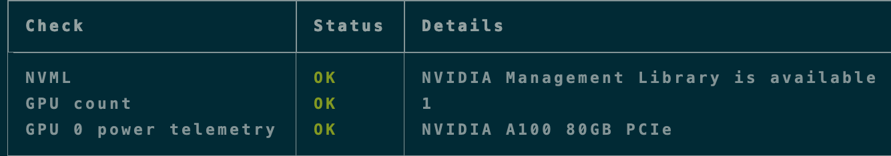
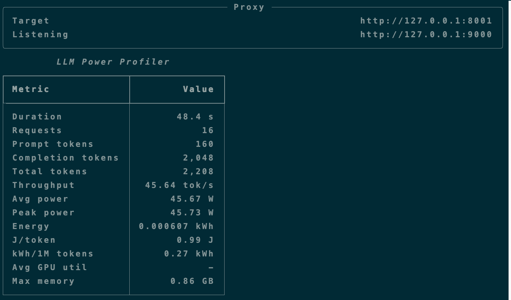

# llm-power-profiler

`llm-power-profiler` is a lightweight local monitor that measures watts, tokens, and joules per token for OpenAI-compatible LLM servers.

> `nvidia-smi` tells you watts. `llm-power-profiler` tells you joules per token.

## Why

Local LLM servers such as vLLM, SGLang, TGI, llama.cpp, and Ollama-compatible endpoints can report token usage, while NVIDIA GPUs can report power telemetry through NVML. `llm-power-profiler` connects those two signals so you can understand the energy profile of your own inference workload.

This project is intentionally lightweight:

- No daemon
- No database
- No Prometheus required
- No root required
- No benchmark harness required

## Install

```bash
pip install llm-power-profiler
```

For local development:

```bash
git clone https://github.com/chenxuniu/llm-power-profiler
cd llm-power-profiler
pip install -e .
```

## Quick Start

Start your OpenAI-compatible LLM server, for example vLLM:

```bash
vllm serve meta-llama/Llama-3.1-8B-Instruct --port 8000
```

Run the profiler as a local proxy:

```bash
llm-power-profiler proxy \
  --target http://localhost:8000 \
  --port 9000 \
  --gpus 0 \
  --export reports/session.json
```

Send requests through the profiler:

```bash
curl http://localhost:9000/v1/chat/completions \
  -H "Content-Type: application/json" \
  -d '{
    "model": "meta-llama/Llama-3.1-8B-Instruct",
    "messages": [{"role": "user", "content": "Explain joules per token in one sentence."}],
    "max_tokens": 128
  }'
```

The terminal dashboard shows aggregate power and token metrics:

```text
Requests        128
Total tokens    842,112
Throughput      1,284 tok/s
Avg power       421 W
Peak power      518 W
Energy          0.37 kWh
J/token         1.58
kWh/1M tokens   0.44
```

## Screenshots

NVML and A100 power telemetry check:



Local proxy smoke run with the mock OpenAI-compatible server:



The mock server is useful for validating the monitoring pipeline. Real LLM energy numbers should be collected with an actual inference server such as vLLM or SGLang.

## Commands

```bash
llm-power-profiler doctor
```

Checks whether NVML and NVIDIA GPU power telemetry are available.

```bash
llm-power-profiler watch
```

Displays a lightweight GPU power/utilization/memory/temperature view.

```bash
llm-power-profiler proxy --target http://localhost:8000 --port 9000
```

Runs a local OpenAI-compatible proxy and calculates aggregate watts, tokens, and joules per token.

Add `--export reports/session.json` to write a JSON report when the proxy exits.

Add `--gpus 0,1` to sample a subset of local NVIDIA GPUs.

## Try Without a GPU

You can test the token-accounting path with the included mock OpenAI-compatible server:

```bash
python3 examples/mock_openai_server.py
```

If port `8000` is already in use:

```bash
python3 examples/mock_openai_server.py --port 8001
```

Then run the proxy:

```bash
llm-power-profiler proxy \
  --target http://127.0.0.1:8000 \
  --port 9000 \
  --export reports/mock-session.json
```

If NVML is unavailable, token metrics still work and power metrics are marked as disabled.

Generate repeatable test traffic:

```bash
python3 examples/traffic_generator.py \
  --base-url http://127.0.0.1:9000 \
  --model mock-llm \
  --requests 16 \
  --concurrency 4 \
  --max-tokens 128
```

## MVP Scope

The first version focuses on:

- NVIDIA GPUs through NVML
- OpenAI-compatible HTTP APIs
- `/v1/chat/completions` and `/v1/completions`
- response `usage.prompt_tokens`, `usage.completion_tokens`, and `usage.total_tokens`
- aggregate session metrics
- terminal-first monitoring
- non-streaming responses

Not in the first version:

- multi-node attribution
- Slurm integration
- DCGM dependency
- request-level precise energy attribution
- CPU or DRAM power telemetry
- hosted dashboard
- streaming token accounting

## Metrics

Core metrics:

- duration
- request count
- prompt tokens
- completion tokens
- total tokens
- tokens per second
- average GPU power
- peak GPU power
- energy in joules, Wh, and kWh
- joules per token
- kWh per 1M tokens
- GPU utilization
- GPU memory usage

## Relationship to TokenPowerBench

TokenPowerBench is for rigorous LLM inference power benchmarking across engines, models, datasets, and cluster configurations.

`llm-power-profiler` is for lightweight local monitoring while you are already running an LLM server.

## Development

```bash
pip install -e ".[dev]"
llm-power-profiler doctor
```

Run a quick syntax check:

```bash
python3 -m compileall src
```

Run tests:

```bash
PYTHONPATH=src python3 -m unittest discover -s tests
```

See [docs/validation.md](docs/validation.md) for a step-by-step local validation flow.
See [docs/minimal-validation.md](docs/minimal-validation.md) for the lowest-burden validation plan.
See [docs/experiments.md](docs/experiments.md) for the first A100/H100/H200 experiment plan.
See [docs/hpec-paper-plan.md](docs/hpec-paper-plan.md) for the short paper direction.
